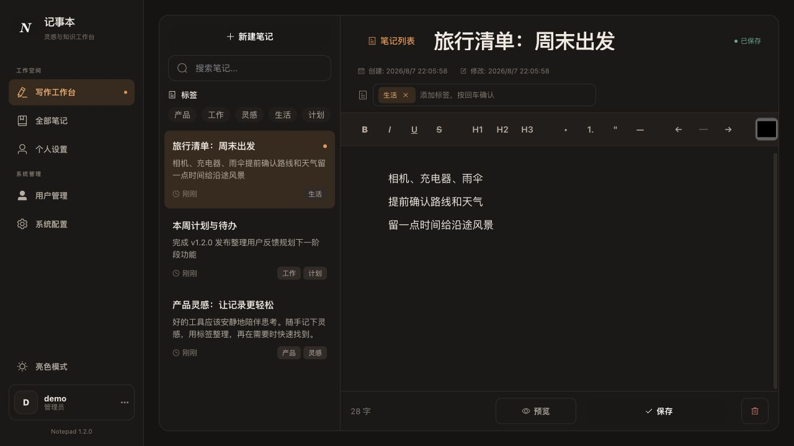
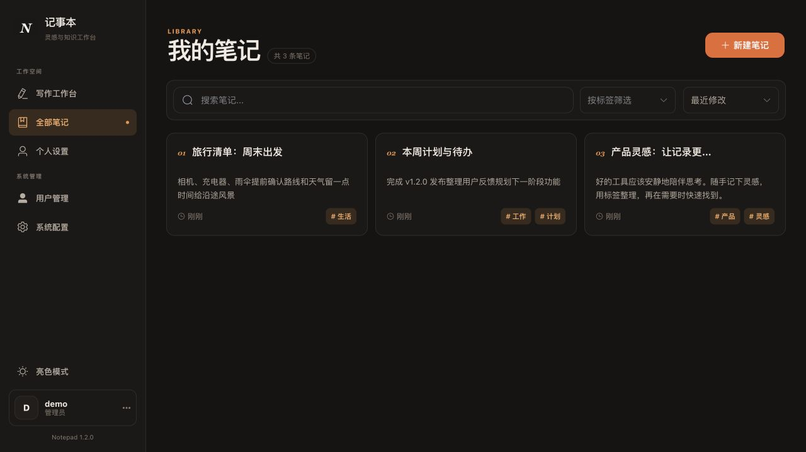
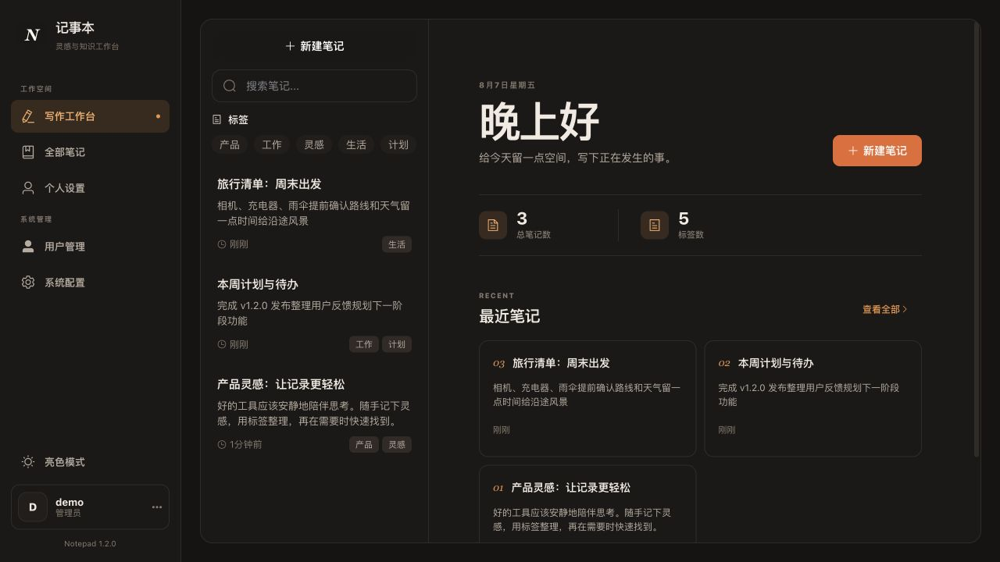
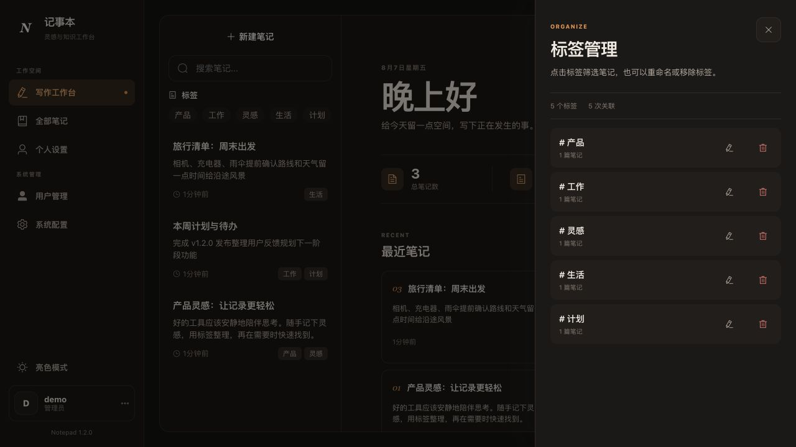
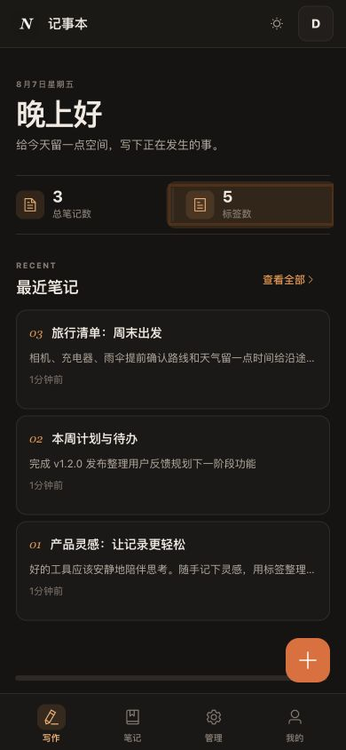

# 记事本 (Notepad)

一款轻量、精美的多用户记事本 Web 应用，支持富文本编辑、标签分类管理、暗色模式、多用户数据隔离，可部署到飞牛NAS、Docker 或直接运行。

## 技术栈

- **前端**: Vue 3 + Element Plus + Vite
- **后端**: Go + Gin + SQLite (modernc.org/sqlite, 纯 Go 无 CGO)
- **认证**: JWT + bcrypt

## 功能特性

- 笔记的创建、编辑、删除、搜索
- 多用户注册登录，数据完全隔离
- 管理员管理用户和系统配置
- 安全问题找回密码
- 终端命令恢复管理员账号
- 一条数据一个配置项，管理员可控制是否允许注册等
- 首个注册用户自动成为超级管理员（唯一）
- 数据库自动迁移，支持版本升级

## 界面预览

### 写作工作台



### 全部笔记



### 工作台首页



### 标签管理



### 手机端

<p align="center">
  
</p>

## 快速开始

### 直接运行

```bash
# 从 release 目录下载对应平台的二进制文件
./notepad

# 访问 http://localhost:8904
# 第一个注册的用户自动成为管理员
```

### Docker 运行

```bash
docker run -d \
  --name notepad \
  -p 8904:8904 \
  -v ./data:/app/data \
  techfunways/notepad:latest
```

登录签名密钥会自动生成并保存到数据目录，也可通过 `JWT_SECRET` 环境变量指定固定密钥。

### Docker Compose

```bash
docker compose up -d
```

### 飞牛NAS 安装

1. 下载与设备架构对应的 `.fpk` 安装包
2. 在飞牛应用中心选择"手动安装"
3. 上传 FPK 包
4. 按向导提示配置服务端口和共享目录权限

## 终端命令

```bash
# 查看管理员用户名
./notepad find-admin

# 重置管理员密码
./notepad recover-admin

# 列出所有用户
./notepad list-users
```

## 环境变量

| 变量 | 默认值 | 说明 |
|------|--------|------|
| PORT | 8904 | 服务端口 |
| DB_PATH | ./data/notepad.db | SQLite 数据库路径 |
| JWT_SECRET | 数据目录中自动生成并持久化 | JWT 签名密钥（可设置固定值覆盖） |
| DATA_DIR | ./data | 数据目录 |

## 从源码构建

```bash
# 前置要求: Go 1.22+, Node.js 20+

# 完整构建（前端+后端+FPK）
make build-fpk

# 或使用 Makefile
make build          # 当前平台
make cross-compile  # 多平台交叉编译
make build-fpk      # 飞牛 FPK 包
```

构建产物输出到 `release/<version>/` 目录。

## 项目结构

```
├── server/              # Go 后端
│   ├── main.go          # 入口（服务器/CLI）
│   ├── cmd/             # 服务启动 + CLI 命令
│   ├── config/          # 配置加载
│   ├── database/        # SQLite + 迁移
│   ├── model/           # 数据模型
│   ├── handler/         # API 处理器
│   ├── middleware/       # 认证/CORS
│   ├── auth/            # JWT 工具
│   ├── router/          # 路由注册
│   └── static/          # 嵌入前端资源
├── web/                 # Vue 3 前端
│   └── src/
│       ├── views/       # 页面视图
│       ├── components/  # 布局组件
│       ├── stores/      # Pinia 状态
│       ├── api/         # API 调用
│       └── router/      # 前端路由
├── scripts/             # 构建脚本
│   ├── build-all.sh     # 多平台编译
│   ├── build-fnpack.sh  # 飞牛 FPK 打包
│   └── build-docker.sh  # Docker 镜像
├── fnpack/              # 飞牛 FPK 模板
├── VERSION              # 版本号
├── Makefile             # 构建入口
└── Dockerfile           # Docker 多阶段构建
```

## 升级

数据库支持自动迁移。升级时只需替换二进制文件或更新 Docker 镜像，数据库会自动升级到最新版本。

## License

MIT

## 支持作者

如果记事本帮到了你，欢迎微信扫码请作者喝杯咖啡——金额随意，1 元也是心意：

<p align="center">
  
</p>

应用内的赞赏入口（启动弹窗、顶部横幅、右下角支持按钮）随时可用；支持记录按版本号记忆，升级到新版本后会再次提醒。支持完全自愿，不支付不影响任何功能。
